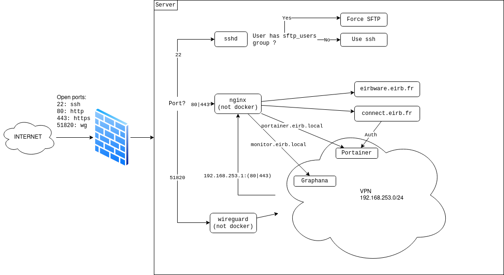

# Architecture

Eirbware dispose **d'un VPS**, et héberge des services pour les élèves de
l'ENSEIRB-MATMECA et l'associatif de l'école.

## Historique de l'architecture

L'architecture précédente avait été pensée comme étant assez restrictive et
sécurisée, elle utilisait des scripts pour ajouter de nouveaux sites web, et
était un peu _(trop?)_ rigide.

La plupart des sites étaient des sites statiques et en php, tous servis par **un
seul serveur apache**. Il était possible de rajouter des sites avec **docker** en mode
[rootless](https://docs.docker.com/engine/security/rootless/), le serveur apache précédent était utilisé comme
**reverse proxy** dans ce cas-là.

Cependant, rien n'était pas documenté, et les connaissances quant à la façon
dont le serveur devait être utilisé ont été perdues, ce qui a poussé à lancer
les conteneurs avec le démon rootful par soucis de simplicité.

Le but de ce site et de ne pas perdre ces connaissances, et d'apprendre des
systèmes précédents, qui n'étaient pas des échecs, mais qui étaient perfectibles.

## La nouvelle architecture (2025)

La nouvelle architecture a pour but de trouver un bon équilibre entre sécurité,
évolutivité et facilité d'utilisation.

La sécurité est l'aspect, le plus important, mais la facilité d'utilisation ne
doit pas être sous-estimée. Le mandat changeant toutes les années, il faut que
la prise en main et la documentation soit suffisante, auquel cas des décisions
pourraient être prise pour réduire la sécurité au profit de la facilité
d'utilisation.

Cela a été le cas précédemment, `sudo` avait été désactivé, car non nécessaire à
l'utilisation du serveur telle qu'elle avait été pensée. Mais étant trop
désagréable d'utilisation et peu compris, il a été réactivé, et les conteneurs
étaient lancés en rootful, ce qui a bypass au passage les règles du pare-feu.

C'est donc à la lumière de ces évènements qu'une nouvelle architecture a été
proposée.

### Vue globale

Il est important avant toute chose d'avoir une vue globale du fonctionnement
de cette nouvelle architecture.

La nouvelle architecture est constituée de :

* Une **partie firewall**, limitant les ports sortant
* Un **reverse proxy** principal, nginx est utilisé, car moins obscure qu'apache
* Un accès **ssh**, offrant des accès en [SFTP](https://en.wikipedia.org/wiki/SSH_File_Transfer_Protocol)
* Tous les sites web sont maintenant hébergés dans des **dockers**, ce qui **uniformise** le fonctionnement du serveur
* Certains services sensibles ne sont accessibles que depuis un **VPN** ([wireguard](https://www.wireguard.com/)).

Chacune de ces parties contient un nombre **conséquent de subtilités**, et seront
développées dans les sections suivantes.

Schématiquement, voici à quoi ressemble l'architecture :

{ align=left, loading=lazy }
/// caption
Vue globale de l'architecture du VPS d'Eirbware
///

On essaye d'utiliser un **maximum d'applications** avec **docker rootless**, cependant
cela peut parfois trop complexifier le fonctionnement du serveur, c'est pourquoi
il a été choisi que certains services seront lancés **sans docker**
(ex : nginx principal et wireguard) et que d'autres sont dans des **dockers rootful**
(ex : portainer).

Plus de détails relatifs à ces choix seront dans les sections relatives à ces sujets.

### Pourquoi Almalinux ?

La question de la distribution linux a utilisée pour le VPS s'est rapidement
posée, et plusieurs candidats sont sortis du lot :

* [Debian](https://www.debian.org/)
* [Almalinux](https://almalinux.org/)
* [CoreOs](https://fedoraproject.org/coreos/)

Voici un tableau des fonctionnalités proposées par chacune des distributions :

|         | Debian           | Almalinux        | CoreOs           |
|         |                  |                  |                  |
| LTS     | :material-check: | :material-check: | :material-close: |
| SeLinux | :material-close: | :material-check: | :material-check: |

Almalinux et CoreOs sont des distributions de la famille de Fedora, CoreOs est
pensé pour être sécurisé, et être utilisé principalement avec des conteneurs.

CoreOs a beaucoup de spécificités et difficile à prendre en main. De plus, elle
ne propose **ne propose pas de LTS**, i.e. nécessite de faire des **mises à
jour majeures fréquemment**, ce qui a été jugé trop contraignant sachant qu'un mandat d'Eirbware
est de 1 an.

Almalinux quant à elle propose une **LTS**, et étant basée sur Fedora, elle a
une **bonne intégration de** [**SELinux**](https://www.redhat.com/en/topics/linux/what-is-selinux), un module de sécurité niveau kernel pouvant
prévenir de montées en privilèges comme des échappements de docker.

!!! note "Choix final"

    Il a été jugé que Almalinux était plus intéressant que Debian, notamment par
    rapport à son support de SELinux (les paquets proposés par le gestionnaire `dnf`
    ont tous une configuration testés au préalable pour Fedora).

### Installation de la nouvelle architecture

En plus de cette documentation, nous avons essayé **d'automatiser l'installation** de
l'architecture, le but étant de garder une trace écrite de la **méthode exacte**
d'installation du serveur.

L'installation se fait suite à l'installation par l'utilisation d'un script
[shell POSIX](https://pubs.opengroup.org/onlinepubs/9699919799/utilities/V3_chap02.html).
Ce script peut être trouvé sur [ce dépôt d'Eirbware](https://github.com/Eirbware/server), il est en privé, car
on n'est jamais à l'abri d'une **erreur de configuration**, mais il peut être manuellement
partagé avec **quiconque étant intéressé par le projet**.

### Firewall

Deux mécanismes de défense sont mis en place pour le firewall : un mécanisme
**statique** et un mécanisme **dynamique**.

Le premier firewall est [`firewalld`](https://firewalld.org/), il est préinstallé sur Almalinux. Ce firewall
est statique et permet d'empêcher l'accès aux ports autre que :

* 22 (pour `SSHD` et `SFTP`)
* 80 (pour `HTTP`)
* 443 (pour `HTTPS`)
* 51820 (pour `wireguard`, le VPN)

C'est notamment important pour prévenir de mauvaises configurations de conteneurs
qui configureraient des forwarding sur `0.0.0.0` plutôt que `127.0.0.1`.

Le second firewall est [`crowdsec`](https://www.crowdsec.net/), il s'agit d'une solution dynamique, à partir des logs, il essaye de détecter des schémas
d'attaques et de prendre une décision en conséquence comme un ban IP.

